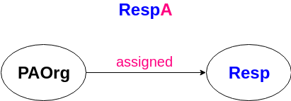
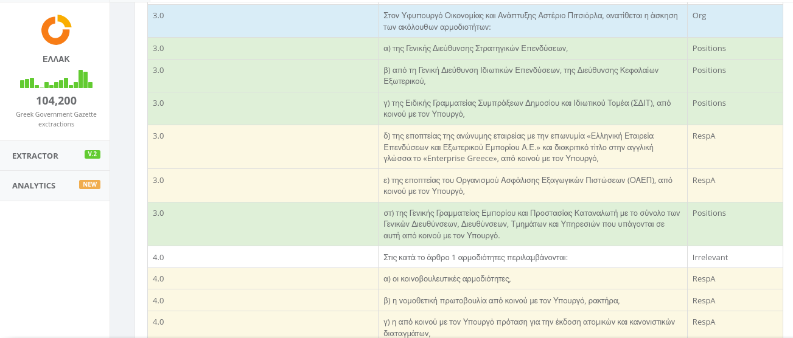

# ggx


## Extract and classify Greek Government Gazzette documents

Extract and classify Responsibility Assignments (RespA) of Public Administration Organizations (PAOrgs)

<p align="center">
  
</p>

from issues such as:

<p align="center">
  
</p>

## Install
```bash
pip install -e .
```

## Use
### Train classifier and predict Greek Government Gazette PDF files
```python
from ggx.src.classifier import Classifier

# FILES
stopwords_file = 'ggx/data/greek_stopwords.txt'
orgs_file = 'ggx/data/organizations.csv'
# Premade organization trie index
org_trie_file = 'ggx/data/training/pickle/0orgtrie.pkl'
# Premade trie index for Responsibility Assignments
respa_trie_index_file = 'ggx/data/training/pickle/1trie.pkl'
# Premade weights of the frequent stems of the Responsibility Assignments
respa_weights_file = 'ggx/data/training/pickle/1weights.pkl'
# Phrases that refer to organizations
orgs_training_file = 'ggx/data/training/organizations_training.csv'
output_predictions_file = 'ggx/data/output_predictions.csv'

# DIRECTORIES
respas_dir = 'ggx/data/training/RespAs/'
non_respas_dir = 'ggx/data/training/Non-RespAs/'
input_pdf_dir = 'ggx/data/input_pdfs/'
output_txt_dir = 'ggx/data/output_txts/'

# FILENAMES
pdf_filename = 'random_GG_issue'

# RATIOS
# How many frequent stems will be selected when creating a trie index for the
# organizations. You can play around with this value to correct your
# predictions.
orgs_ratio = 0.015
# Ratio similar to the organizations ratio
respas_ratio = 0.02

# LENGTHS
org_len = 40
respa_len = 50
non_respa_len = 100

# FLAGS
# Create the trie index or read from file
flag_create_trie_index = False

# KEYS
ARTICLE_NUMBER_KEY = 'ArticleNo'
PREDICTION_KEY = 'Prediction'
RAW_PARAGRAPH_KEY = 'RawParagraph'

cl = Classifier(
    stopwords_file,
    orgs_file,
    orgs_ratio,
    org_len)
cl.read_org_trie_from_file(org_trie_file)
cl.read_trie_index_from_file(respa_trie_index_file)
cl.read_weights_from_file(respa_weights_file)
# Train the classifier with organization phrases
cl.org_classifier_from_file(orgs_training_file)
# Train the classifier with files containing RespA/Non-RespA phrases
cl.respa_classifier_from_pdf_files(
    respas_dir,
    respa_len,
    non_respas_dir,
    non_respa_len,
    respas_ratio,
    flag_create_trie_index)
# Predict a pdf file and return a dataframe
predictions = cl.predict_pdf_file(
    pdf_filename,
    respa_len, org_len,
    input_pdf_dir,
    output_txt_dir)
```
### Output predictions and feed them to the [correction tool](https://thodoris.github.io/fekextractor/)
```python
predictions[[
    ARTICLE_NUMBER_KEY,
    PREDICTION_KEY,
    RAW_PARAGRAPH_KEY
]].to_csv(output_predictions_file, sep='\t')
```
### Correct predictions and export csv
e.g. 

<p align="center">
  
</p>

### Retrain classifier
```python
# This is the output csv file of the correction tool
corrected_predictions_file = 'ExampleFile.csv'
# This was produced by the classifier
training_file = 'training_file.csv'
cl.update_org_classifier(
    orgs_training_file,
    corrected_predictions_file,
    org_len)
cl.classifier_from_enriched_train_samples(
    training_file,
    corrected_predictions_file,
    respa_len,
    non_respa_len,
    respas_ratio)
```

For more details, check out the [Implementation](https://github.com/ckarageorgkaneen/ggx/wiki/Implementation).

This project is an improvement of [the gsoc2018-GG-extraction fork](https://github.com/kontopoulos/gsoc2018-GG-extraction).
